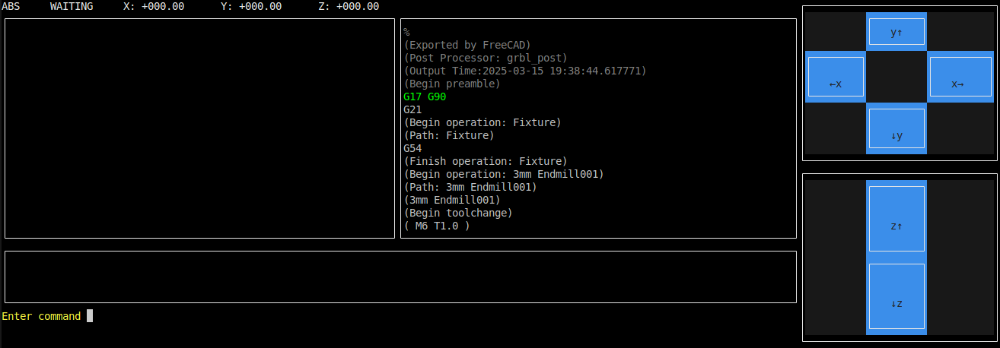
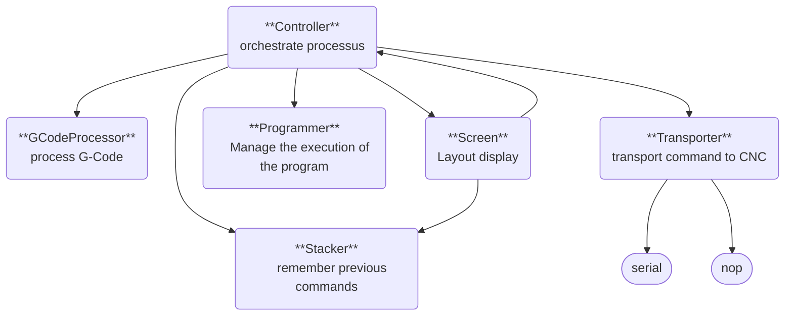

# CNC Serial

Simple serial monitor to communicate with UART and control 3D printers or CNC. This is running on a text console.

It implements :
* helpers for G-code
* program management (read, send commands step by step)




## Prerequisite

You must have a sane instalation of :
* golang (minimum version: 1.18)
* protobuf-compiler
* protoc-gen-go

```
go install google.golang.org/protobuf/cmd/protoc-gen-go@latest 
go install google.golang.org/grpc/cmd/protoc-gen-go-grpc@latest
```

## Build

```
make build
```

## Usage

```
CNC Serial monitor

Usage:
  cnc-serial [filename] [flags]

Flags:
  -b, --bit-rate int   Bit rate (default 115200)
  -d, --dry-run        Dry run (do not open serial port)
  -h, --help           help for cnc-serial
  -l, --lang lang      language (available: en, fr) (default en)
  -p, --port string    Port name
```

`filename`, if specified, must be a valide G-Code.

## Architecture


