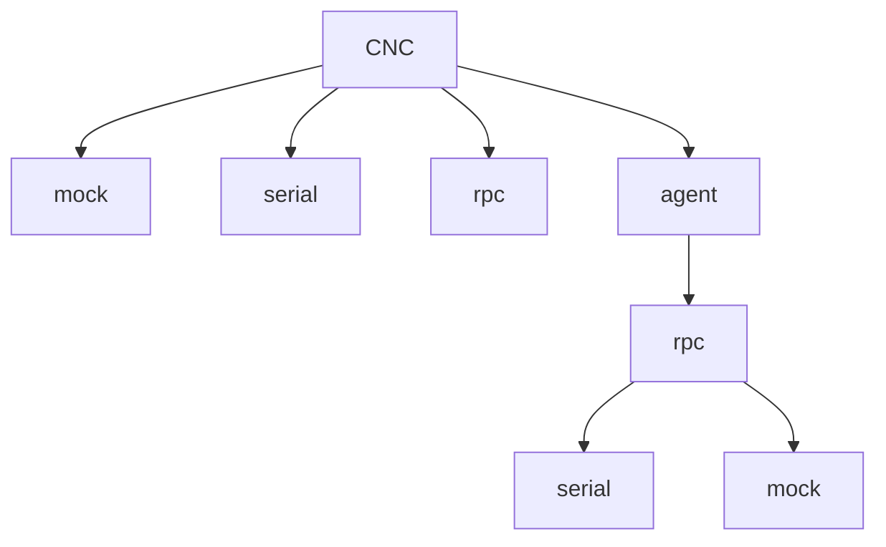
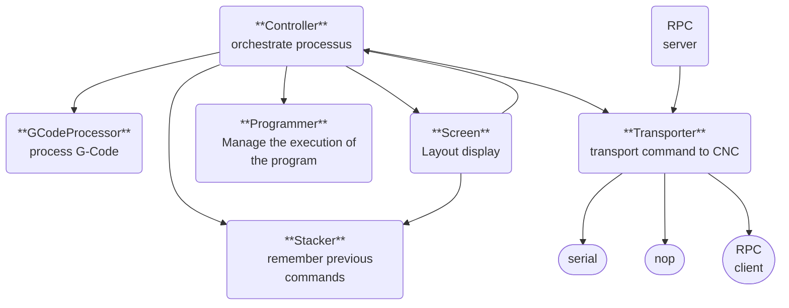

# CNC Serial

Simple serial monitor to communicate with UART and control 3D printers or CNC. This is running on a text console.

It implements :
* helpers for G-code
* program management (read, send commands step by step)


## Prerequisite

You must have a sane instalation of :
* golang (minimum version: 1.18)
* protobuf-compiler
* protoc-gen-go

```
go install google.golang.org/protobuf/cmd/protoc-gen-go@latest 
go install google.golang.org/grpc/cmd/protoc-gen-go-grpc@latest
```

## Build

```
make build
```

## Usage

```
CNC monitor

Usage:
  cnc [command]

Available Commands:
  agent       manage the local agent
  clean       clean gcode
  completion  Generate the autocompletion script for the specified shell
  help        Help about any command
  mock        CNC mock monitor
  rpc         CNC RPC monitor
  save-config save config file
  serial      CNC Serial monitor

Flags:
      --grpc        RPC connection
  -h, --help        help for cnc
  -l, --lang lang   language (available: en, fr) (default en)
```




`filename`, if specified, must be a valide G-Code.

Available environment variables are:
* `CNC_LANGUAGE`: for helpers
* `CNC_NAVIGATIONINC`: increment in milimeters when pushing navigation button 
* `CNC_RPC_CLIENTADDR`: RPC client address
* `CNC_RPC_AGENTADDR`: RPC agent address
* `CNC_SERIAL_PORTNAME`: Serial port name
* `CNC_SERIAL_BITRATE`: Serial bit rate

## Debug

You must install Delve

```
go install github.com/go-delve/delve/cmd/dlv@latest
```

## Architecture


