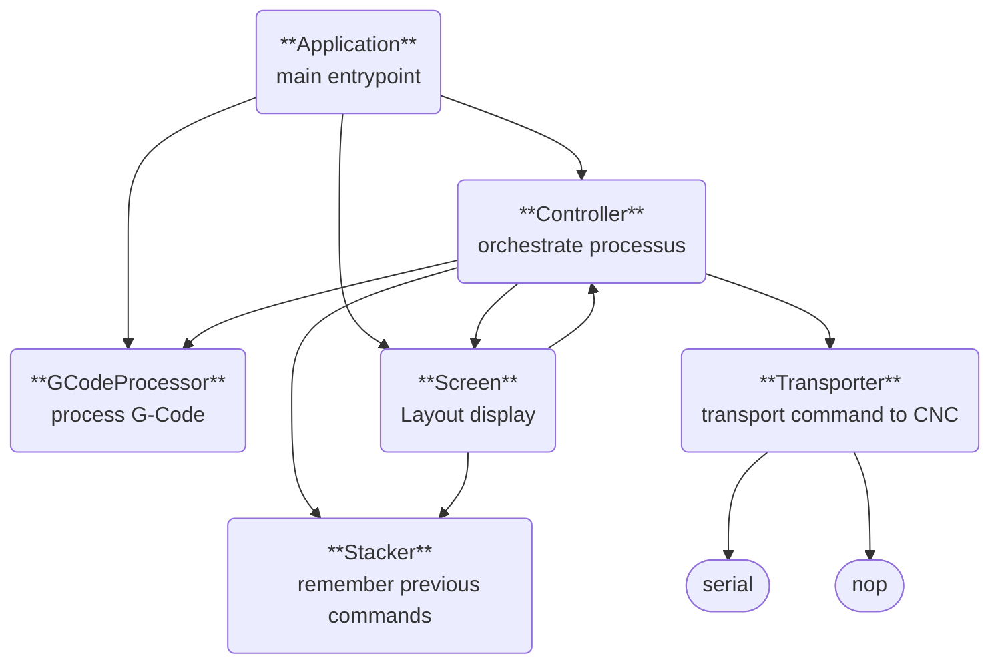

# Serial

Simple serial monitor to communicate with UART. It implements helpers for G-code to control 3D printers or CNC

## Prerequisite

You must have a sane instalation of golang (minimum version: 1.18)

## Build

```
make build
```

## Usage

```
Serial monitor

Usage:
  serial [flags]

Flags:
  -b, --bit-rate int   Bit rate (default 115200)
  -d, --dry-run        Dry run (do not open serial port)
  -h, --help           help for serial
  -l, --lang lang      language (available: en, fr) (default en)
  -p, --port string    Port name
```

## Architecture


